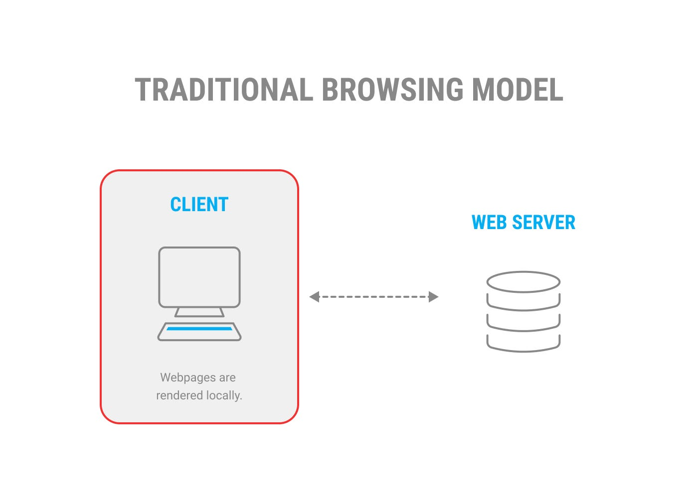
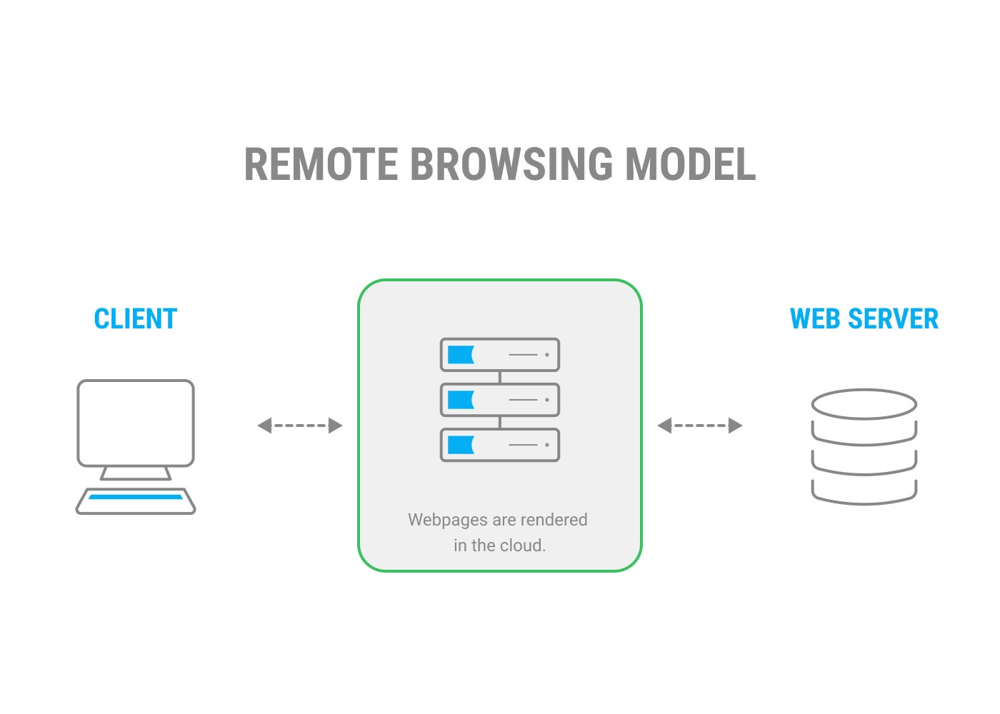
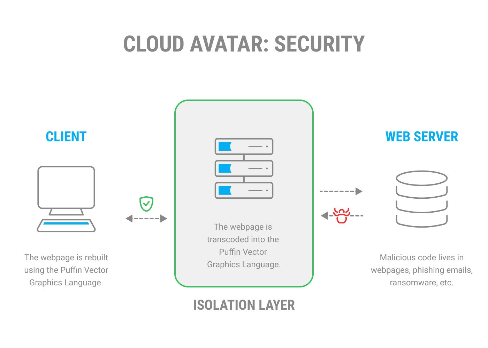
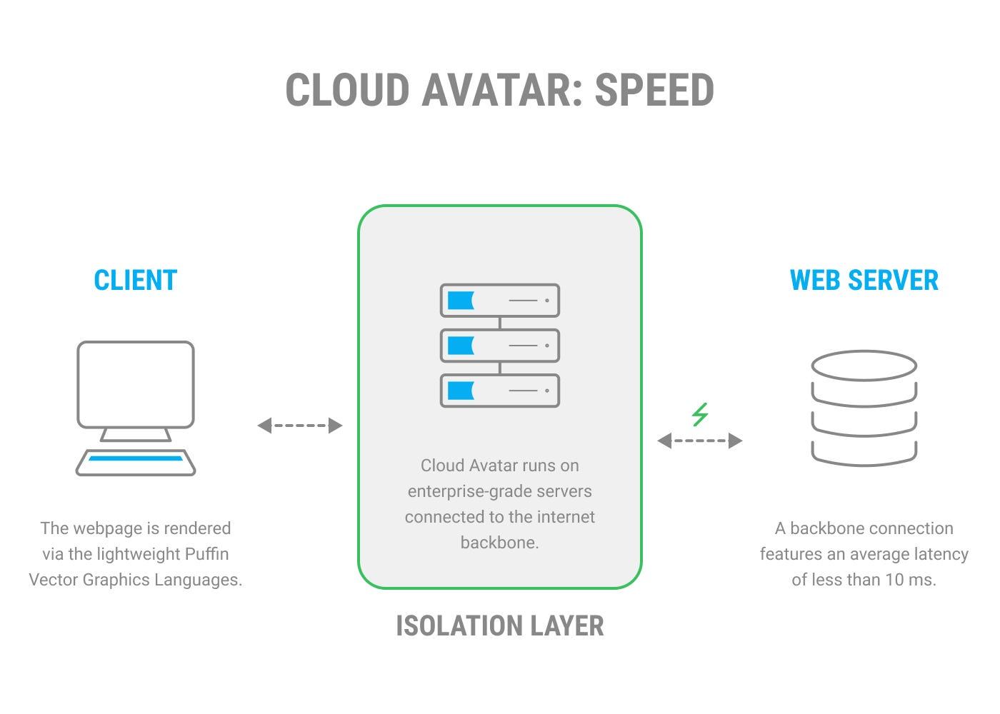

## CloudMosa’s Cloud Avatar — the World’s Most Advanced Remote Browsing Platform

As one of the earliest Chromium developers, we’ve optimized our Cloud Avatar remote browsing platform over the years to maximize its performance. Learn more about what a remote browser is, and how it enables faster and more secure experiences on the web.

## What is a remote browser?

To understand what a remote browser is, let's first see how a regular browser renders web pages.

Compare that to a remote browser, which renders the web pages remotely in a safe environment.

Like many internet technologies, remote web browsing has evolved over the years.

### A brief history

In the early days, pixel pushing and video streaming were used for remote web browsing. These methods help prevent any malicious actors from penetrating the computer, but require a lot of bandwidth which makes them an expensive and laggy solution.

Later, DOM reconstruction entered the scene. While not as slow, it is complex to set up. Also, it isn't as secure – [zero-day attacks](https://medium.com/cloudmosa-en/zero-day-attacks-what-it-is-and-how-it-works-3e66b5c356d7) can still break through during DOM reconstruction.

The newest remote browsing technique utilizes **vector graphic drawing commands.** This means the page is rendered in the cloud, and lightweight drawing commands are transmitted to rebuild the web page on the user's device.

This technique has become more popular, but the quality of implementation depends on the vendor. It’s important to look into security, browsing speed, and device performance.

## What makes Cloud Avatar different?

Since 2009, our Puffin Vector Graphics Language has served over 150 million web browsers globally. Cloud Avatar's proprietary remote browsing technology offers several advantages.

### It’s more secure

By transcoding the webpage into the Puffin Vector Graphics language, any potential threats are stripped away before they reach the user’s device.

This happens in mere milliseconds, producing a sanitized version of the webpage in the client’s browser. A good analogy would be akin to boiling an egg:

1. Cloud Avatar grabs the potentially harmful content (the raw egg) and then transcodes it (boils it).
2. Any threats (salmonella) are removed because the webpage *completely changes its structure* during transcoding.
3. The new content (the cooked egg) is now 100% safe for consumption.

Here’s a more technical explanation:

1. Webpages are built using HTML, CSS, and Javascript.
2. Hackers exploit vulnerabilities in these scripting languages to attack users via phishing scams, ransomware, bots, and more.
3. By transcoding the webpage into a different language, we effectively “boil” any malicious code away.

Just as boiling water kills harmful organisms, transcoding neutralizes threats to make our Cloud Avatar technolgoy an incredibly safe way to browse the internet.

### It’s faster

Cloud Avatar surfs the internet faster than a regular browser, because of two reasons.

1. Our Cloud Avatar servers sit in enterprise-level data centers with a high-speed link to other servers
2. Our http payloads are much lighter thanks to the transcoding of the webpage into the Puffin Vector Graphics Language.

Unlike a home or office browser which requires multiple hops to reach the internet, a direct backbone connection gives Cloud Avatar faster access to any server on the web.

### It works on low-powered devices

Cloud Avatar also boosts the browsing performance of low-powered devices. There are still billions of users using feature phones around the world, and it has always been our mission to enable equitable access to the internet. Cloud Avatar helps us do that.

 to access the internet as quickly as flagship phones from iPhone or Samsung.")

Thanks to its performance, Cloud Avatar was selected by the [Lava](https://www.lavamobiles.com/) telecom group in India as the engine for its [Lava Cloud Store](https://www.lavamobiles.com/entitydetail/lava%20cloud%20store%20apps.pdf). It provides a wide user base access to websites that would otherwise be inaccessible or laggy on a low-powered device.

## How do I start remote browsing?

Our recommended remote browser is Puffin Secure Browser — a desktop browser for both [Windows](https://download.puffinbrowser.com/win/PuffinSecureBrowser-latest.php) and [macOS](https://download.puffinbrowser.com/mac/PuffinSecureBrowser-latest.php). Protect your team from zero-day attacks with the most advanced remote browsing platform available on the market today.

It is available for $5/month or $50/year with [a yearly Puffin 365 subscription.](https://www.puffin.com/365)

Enterprise users: please [contact us](https://www.puffin.com/contact-us) for an in-person demo or to inquire about enterprise integration.

### About CloudMosa

Since 2009, CloudMosa has been a pioneer in remote browsing technology. We were founded by former Google, Microsoft, and Yahoo employees with a passion for creating better experiences on the web.
